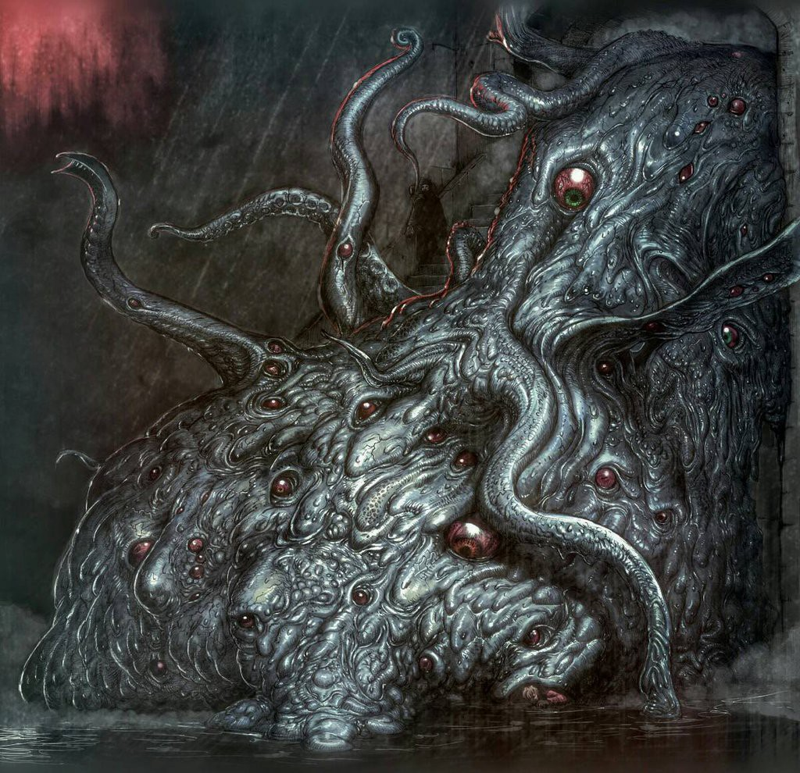

# Sinestèsia 

El guió de *Sinestèsia* el vaig escriure tot just començar el primer curs a l’ESCAC. Hi realitzàvem un intensiu de teatre i m’estava adaptant a la vida fora de casa, de manera que anava bastant estressat i em sentia sol. En el guió vaig tractar de donar forma expressiva a la confusió que sentia, tot projectant els meus sentiments en un personatge que passa de ser un catòlic devot a experimentar una crisi existencial que desemboca en dubtes sobre la seva identitat. S’hi percep la influència del cinema de Roy Andersson, la trilogia sobre la vida del qual acabava de veure i volia fer alguna cosa per l’estil. Vaig redactar una primera versió de la història i després l’he deixada reposar al calaix, però crec que manté prou interès per figurar en aquesta secció i és molt probable que en el futur li torni a donar una ullada. 

[Guió complet](assets/pdf/Sinestesia.pdf){:target="blank"}

{:height="30%" width="30%"}

# Mírame

El guió d’aquest curt, escrit conjuntament amb el meu company Marc Camardons,  presenta una reflexió irònica sobre el tema del suïcidi, a través de la veu de dos personatges aparentment oposats.

# La Criatura

*La Criatura* és un guió que conté una reflexió al·legòrica sobre la corrupció del poder. El vaig escriure originalment com un treball per a un intensiu de diàleg, dirigit pel dramaturg Sergi Pompermayer. La versió disponible aquí és el producte de diverses reescriptures i la combinació  entre humor negre, terror i sàtira política de la proposta, crec que pot resultar atractiva.

[Guió complet](assets/pdf/La-Criatura.pdf){:target="blank"}

{:height="30%" width="30%"}

# Padre, hemos pecado

*Padre, hemos pecado* és un guió en el qual vaig participar juntament amb els meus companys, Laura Marqués i Miquel Felipe per al treball final de direcció del meu company Gabriel Olivares.

[Veure el curtmetratge](https://www.youtube.com/watch?v=E9rl6thSlJ8){:target="blank"}

{:height="12%" width="12%"}

# A las diez / El deseo

Guió desenvolupat amb el meu company Gabriel Cagide per al seu treball final de direcció del segon curs de l’ESCAC.  Es basa en un relat de James Salter i gira al voltant de la relació d’una parella burgesa amb un noi bohemi que comença a viure amb ells. A tall de contrast, he decidit incloure-hi la primera versió, redactada amb absoluta llibertat, conjuntament amb la versió, molt més ajustada a les intencions del meu company, que finalment es va rodar.

[Veure el curtmetratge](https://www.youtube.com/watch?v=swLevRQe62k){:target="blank"}

[Guió complet](assets/pdf/El-Deseo.pdf){:target="blank"}

{:height="30%" width="30%"}

# La part invisible

A parer meu, i tenint en compte que es tracta d’una primera versió, *La part invisible* és un dels millors guions de curtmetratge que he escrit. S’inspira una mica en l’esperit de sèries com *The Twilight Zone* i ens conta la història d’uns sonoristes que descobreixen una realitat paral·lela, regida per unes lleis físiques diferents, a la qual tan sols es pot accedir a través del so. El projecte va començar com un exercici de l’assignatura de Guió del tercer curs de l’ESCAC.

[Guió complet](assets/pdf/La-Part-Invisible.pdf){:target="blank"}

{:height="30%" width="30%"}

# Nick of Time 

*Nick of Time* és un curiós exercici que també vaig fer per a l’assignatura de guió de tercer, en què havíem d’escriure un guió a partir de la sinopsi d’un capítol original de la sèrie *The Twilight Zone*. Aquest n’és el resultat.

[Guió complet](assets/pdf/Nick-of-Time.pdf){:target="blank"}

{:height="30%" width="30%"}

# Híbrids

Híbrids és el meu TFG, un guió de llargmetratge, desenvolupat sota la tutoria del professor Jaume Macià.  Consisteix en un *thriller* que conta la història complexa d’una parella de modestos detectius valencians que accepten l’encàrrec, aparentment rutinari, de cercar una dona que un d’ells ha vist en somnis, empresa que es convertirà en un autèntic malson.

[Guió complet](assets/pdf/HIBRIDS.pdf){:target="blank"}

{:height="30%" width="30%"}

