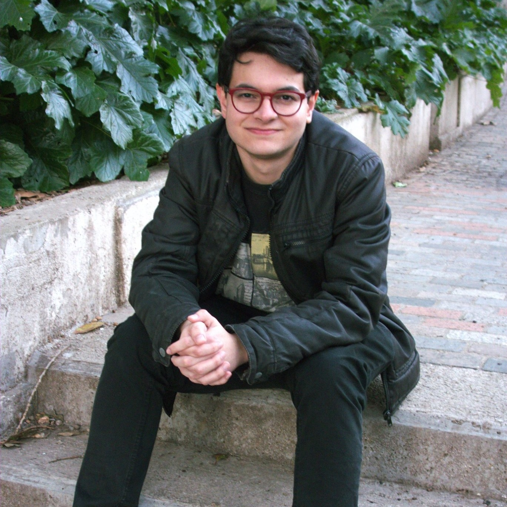

El meu nom és Jordi Conill Salomé, graduat en cinematografia per l'ESCAC i en Humanitats i Estudis Interculturals per la Universitat Jaume I. M'agrada escriure guions i dirigir pel·lícules per damunt de qualsevol altra cosa, i al llarg d’aquest statement tractaré de contar com va sorgir la meva vocació.  

Quan miro enrere, recordo el cinema com una de les constants de la meva vida. Els meus pares són molt cinèfils i des que era un nadó vaig veure pel·lícules amb ells. El cinema, com l'hàbit de llegir o la curiositat pel coneixement forma part consubstancial del bagatge que em van transmetre durant la meva infantesa, fins al punt que aquesta no s’explica sense l’entusiasme pels grans còmics del cinema mut i les pel·lícules dels germans Marx o sense la fascinació pel western, un gènere que vaig visionar de manera molt completa durant els meus anys escolars. Dit això, si hagués d’explicar amb detall al lector d’aquestes línies l’evolució de la meva passió cinematogràfica, podria identificar-la amb cinc moments clau. 

El primer es remunta al dia en què vaig veure per primera vegada una pel·lícula tan poc infantil com 2001: A Space Odyssey. Tenia cinc anys i, evidentment, a penes vaig entendre res, però el record de Hal 9000, el monòlit, les naus espacials o aquell estrany final al·lucinatori, vam deixar una forta empremta en la meva imaginació. Alguns anys més tard la vaig tornar a veure i em va sorprendre força, perquè només la recordava vagament, com un d'aquests somnis que tenim durant a la vigília. Aleshores en vaig apreciar una mica millor l'argument, així com la llarga sèrie de preguntes que suscita en la ment de l'espectador. Això no obstant, vull creure que quan era petit ja la vaig entendre, no tant de manera racional com intuïtiva. Val a dir que Kubrick va crear una obra completament basada en la imatge i la música, una experiència audiovisual en el sentit total de la paraula, a través de la qual esdevenim conscients del poder del cinema a l’hora de transmetre sensacions capaces de colpir la percepció de persones de totes les edats. En aquest sentit, n’hi ha prou amb fer referència aquí a l’energia evocadora de l’os que l’homínid llença enlaire i, tot rodant rodant, es transforma en una estació espacial en òrbita al voltant de la Terra; per no parlar de la intensa llum, vermella com la sang, que acompanya la desconnexió del robot Hal 9000, o del muntatge amb imatges trucades i la música de Lux Aeterna de György Ligeti amb què assistim a les visions d’un home amb la ment trastornada per la contemplació d’una realitat que el supera.

La segona fita de la meva trajectòria com a espectador va ser quan vaig anar per primera vegada a una sala de cinema l'any 1999, arran de l’estrena de la pel·lícula Star Wars: The Phantom Menace. A priori semblava (i així ho van jutjar els meus pares) l’ocasió perfecta per iniciar-me en l’experiència cinematogràfica, però la sala a fosques, la grandària de la pantalla, l’orgia d'efectes especials i la potència del so, van fer de tot plegat una experiència traumàtica per a un nen de cinc anys. Vaig sortir de la sala blanc com un full de paper, amb els nervis destrossats i amb les cames que em feien figa, probablement una sensació no molt distinta de la que van experimentar els assistents a la projecció dels germans Lumière sobre l'arribada del tren a l'estació de La Ciutat. Afortunadament, la següent pel·lícula que vaig veure en una sala va ser la plàcida Stuart Little, molt més adequada a la meva edat, que em va servir per reconciliar-me de manera definitiva amb aquells meravellosos locals. Així i tot, passats els anys, he de reconèixer que l’impacte provocat per Star Wars em va ensenyar fins a quin punt pot arribar a ser immersiva l'experiència cinematogràfica. 

La meva tercera epifania cinematogràfica va coincidir amb el visionat de Twin Peaks de David Lynch. Tenia uns catorze anys aleshores, i mai no havia vist res igual. D'una manera estranya vaig sentir que connectava amb el món de Lynch i amb aquella trama embolicada plena de personatges misteriosos, amb tocs de surrealisme i humor negre, una atmosfera tan densa que es podia tallar amb un ganivet i una capacitat envejable per transitar amb desimboltura de la tragèdia a la comèdia i al terror, tot capturant l’espectador en un món tan absurd com fascinant. Sense dubte, Twin Peaks va connectar amb l'adolescent introvertit i amb problemes de relació amb la gent que era en aquella època, i això probablement tenia a veure amb el fet que la sèrie reflectia gairebé totes les coses que m’interessaven i desprenia una sensació de llibertat creativa. En el món del David Lynch podia passar pràcticament de tot, i vaig decidir que jo volia ser una mica com ell. 

Alguns anys després, el 2012, quan jo en tenia divuit, em vaig matricular en el grau d'Humanitats i Estudis Interculturals de la Universitat Jaume I de Castelló i vaig començar a interessar-me intel·lectualment pel cinema. Fins aquell moment, m'agradava sobretot escriure, però el primer any hi vaig realitzar un curs extracurricular de guió, seduït per la idea de formar-me en una activitat que em podia proporcionar un major coneixement de l'escriptura cinematogràfica, tot i que la possibilitat d'estudiar cinema no entrava dins les meves expectatives. Em vaig adonar que em trobava més còmode treballant amb el format del guió que amb altres gèneres més literaris, i que la meva autèntica passió era el cinema. Si no fos per aquell curs de guió, probablement mai no m’hauria matriculat a l'ESCAC. 

Finalment, la culminació del recorregut anterior es va produir quan vaig començar a estudiar el grau de cinematografia de l'ESCAC amb vint-i-quatre anys, un cop finalitzada la carrera d'Humanitats. L'experiència m’ha servit per adquirir els fonaments pràctics de la professió, incrementar moltíssim el meu bagatge cinèfil i conèixer gent que comparteix la meva passió. Però el més decisiu, al meu entendre, és que el pas per l'ESCAC ha reafirmat les meves ganes d'aconseguir ser director i guionista, el meu objectiu inicial quan vaig ingressar a l'escola. 

A hores d’ara, amb un guió de llargmetratge sota el braç, que m’ha servit com a treball de final de grau, esperó amb il·lusió la possibilitat d’iniciar el màster en direcció o guió. Mentrestant deixo testimoni en aquesta web de la trajectòria que m’ha portat fins aquí.

{:height="50%" width="50%"}

